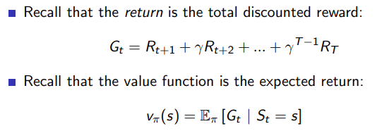
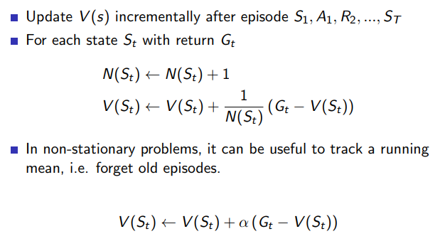
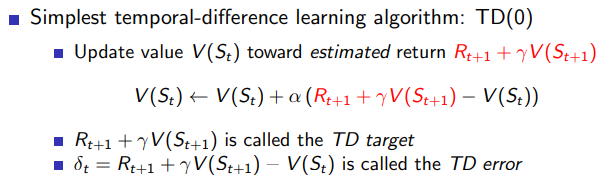

# Model-free prediction

다이나믹 프로그래밍은 에이전트가 환경의 모델(보상, 상태 변환 확률)을 알고 있다는 가정에서 계산하는 것 (Model Based)

환경의 모델을 모르는 경우 환경과 상호 작용을 통해 최적 정책을 학습해 나가는 것이 강화 학습(Model Free)

## Monte-Carlo Prediction

- Monte-Carlo Approximation은 반복적인 샘플링을 통해 정답을 추정한다.
- MC는 경험(에피소드)를 통해 학습한다.
- MC는 model-free이다. (MDP의 transition 과 reward 를 모름)
- MC는 완전한 에피소드를 통해 학습한다.
- MC는 value = mean return 이라는 아이디어를 사용한다.
- MC는 에피소드가 끝나는 문제에만 사용할 수 있다.

### Monte-Carlo Policy Evaluation

정책 π 를 따라갔을 때의 경험을 통해 π의 가치 함수를 학습하는 것



기댓값을 통해 ‘계산’하는 다이나믹 프로그래밍과 달리 몬테 카를로 정책 평가는 경험적 평균을 사용한다.



Monte-Carlo Policy Evaluation은 한 번의 에피소드에서 방문한 상태들의 가치 함수를 해당 에피소드에서 받은 보상을 통해 업데이트한다. 알파는 학습률을 조정하는 스텝사이즈이다.


### 예시
앞서 DP를 통해 구했던 가치함수를 샘플링을 통해 MC로 계산한 코드이다.
```
def MC_prediction(v):
  G = []
  sample = [(0, 0)]
  while sample[-1] != (2, 2):
    i, j = sample[-1]
    p_ij = p[i][j]
    act = A[np.random.choice(np.argwhere(p_ij == np.amax(p_ij)).flatten())]
    i_n, j_n = i + act[0], j + act[1]
    if i_n < 0: i_n = 0
    if j_n < 0: j_n = 0
    if i_n > 4: i_n = 4
    if j_n > 4: j_n = 4

    G.append(rwd[i_n][j_n])
    sample.append((i_n, j_n))

  alpha = 0.2
  g = 0
  for s in reversed(range(len(sample) - 1)):
    i, j = sample[s]
    g = G[s] + df * g
    v[i][j] = v[i][j] + alpha * (g - v[i][j])
  return v
  
# MC prediction
p = [[[0.25 for _ in range(4)] for _ in range(5)] for _ in range(5)]
v = [[0. for _ in range(5)] for _ in range(5)]
for _ in range(1000):
  v = MC_prediction(v)
np.round(v, 2)
```

## Temporal-Difference Prediction

- TD도 경험(에피소드)를 통해 학습한다.
- TD도 model-free이다. (MDP의 transition 과 reward 를 모름)
- TD는 불완전한 에피소드를 통해서 학습할 수 있다.
- TD는 추측으로 추측을 업데이트한다.
    
    → 다음 상태의 가치함수 예측값 V(St+1)으로 현재 상태의 가치 함수 V(St)를 예측한다.(부트스트랩)
    



한 번의 에피소드를 끝내고 가치함수를 업데이트하는 MC와 달리 TD는 한 스텝의 가치 함수를 통해 해당 스텝의 가치 함수를 업데이트 한다.


### 예시
```
def TD_prediction(v):
  G = []
  sample = [(0, 0)]
  alpha = 0.2
  while sample[-1] != (2, 2):
    i, j = sample[-1]
    p_ij = p[i][j]
    act = A[np.random.choice(np.argwhere(p_ij == np.amax(p_ij)).flatten())]
    i_n, j_n = i + act[0], j + act[1]
    if i_n < 0: i_n = 0
    if j_n < 0: j_n = 0
    if i_n > 4: i_n = 4
    if j_n > 4: j_n = 4

    v[i][j] = v[i][j] + alpha * (rwd[i_n][j_n] + df * v[i_n][j_n] - v[i][j])
    G.append(rwd[i_n][j_n])
    sample.append((i_n, j_n))
  return v
  
# TD prediction
p = [[[0.25 for _ in range(4)] for _ in range(5)] for _ in range(5)]
v = [[0. for _ in range(5)] for _ in range(5)]
for _ in range(1000):
  v = TD_prediction(v)
np.round(v, 2)
```

## 강화학습 방법론
