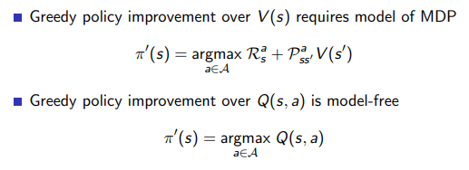
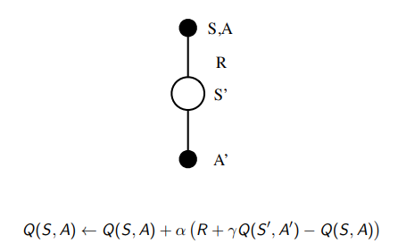
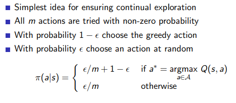
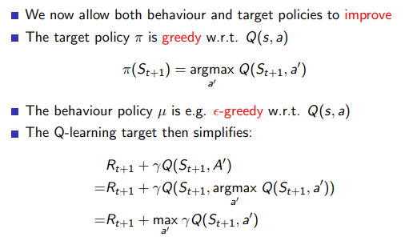

# Model-Free Control

MC와 TD를 사용하면 환경의 모델을 몰라도 가치함수를 구할 수 있다. 그 가치함수를 바탕으로 정책을 발전시키는 것이 Model-Free Control 이다.

## Model-Free Policy Iteration Using Action-Value Function

다이나믹 프로그래밍에서는 가치함수가 가장 큰 상태가 다음 상태가 되도록 그리디하게 정책을 발전시켰다. 하지만 환경의 모델인 상태 변환 확률을 모르기 때문에 다음 상태가 어떻게 될지 알 수 없다. 따라서 Model-Free 문제에서는 상태 가치함수 대신 행동 가치함수(큐함수)를 사용한다.



### SARSA

큐함수를 업데이트 하려면 다음 상태 S’에서의 행동 A’까지 선택해야 한다. 따라서 큐함수를 업데이트 하기 위한 샘플이 [St, At, Rt+1, St+1, At+1] 이 되고 이를 **SARSA** 라고 부른다.



### epsilon-Greedy Exploration

MC 혹은 TD를 사용하여 가치함수를 업데이트 할 경우 다이나믹 프로그래밍과 달리 한 샘플에서 등장한 상태들만 업데이트 하기 때문에 그리디 정책이 가치함수를 잘못된 값으로 수렴하게 할 가능성이 높다. 따라서 입실론 만큼의 확률로 그리디하지 않게 행동을 선택해야 한다.



### 예시
앞서 구현한 MC 혹은 TD를 통해 가치함수를 계산하면 그 가치함수를 바탕으로 정책을 업데이트할 수 있다.
```
def SARSA(q):
  alpha = 0.2
  eps = 0.2

  sample = [(0, 0)]
  i, j = sample[-1]
  if np.random.rand() > eps:
    act = np.random.choice(np.argwhere(q[i][j] == np.amax(q[i][j])).flatten())
  else:
    act = np.random.choice(4)
  action = [act]
  
  while sample[-1] != (2, 2):
    i, j = sample[-1]
    act = action[-1]

    i_n, j_n = i + A[act][0], j + A[act][1]
    if i_n < 0: i_n = 0
    if j_n < 0: j_n = 0
    if i_n > 4: i_n = 4
    if j_n > 4: j_n = 4
    r = rwd[i_n][j_n]

    q_ij_n = q[i_n][j_n]
    if np.random.rand() > eps:
      act_n = np.random.choice(np.argwhere(q_ij_n == np.amax(q_ij_n)).flatten())
    else:
      act_n = np.random.choice(4)

    q[i][j][act] = q[i][j][act] + alpha * (r + df * q_ij_n[act_n] - q[i][j][act])

    sample.append((i_n, j_n))
    action.append(act_n)
  return q

q = [[[0 for _ in range(4)] for _ in range(5)] for _ in range(5)]
for _ in range(10000):
  q = SARSA(q)
np.argmax(q, axis=-1)
```

## On-policy learning vs Off-policy learning

온폴리시 러닝은 현재 행동하는 정책과 학습하는 정책이 같은 것

오프폴리시 러닝은 현재 행동하는 정책과 학습하는 정책이 다른 것

### On-policy learning

- “Learn on the job”
- Learn about policy π from experience sampled from π

### Off-policy learning

- “Look over someone’s shoulder”
- Learn about policy π from experience sampled from µ

## Off-Policy Control with Q-Learning

큐러닝은 오프폴리시 러닝을 사용해서 현재 상태 행동에서는 입실론-그리디 정책을, 다음 상태에서는 그리디 정책을 사용한다.



### 예시
큐러닝을 구현한 코드로 위 SARSA 코드는 행동하는 정책과 개선시킬 정책이 같지만 큐러닝에서는 둘을 다르게 설정하고 학습할 수 있다.
```
def Qlearning(q):
  alpha = 0.2
  eps = 0.2

  sample = [(0, 0)]
  while sample[-1] != (2, 2):
    i, j = sample[-1]
    if np.random.rand() > eps:
      act = np.argmax(q[i][j])
    else:
      act = np.random.choice(4)

    i_n, j_n = i + A[act][0], j + A[act][1]
    if i_n < 0: i_n = 0
    if j_n < 0: j_n = 0
    if i_n > 4: i_n = 4
    if j_n > 4: j_n = 4
    r = rwd[i_n][j_n]

    act_n = np.argmax(q[i_n][j_n])
    q[i][j][act] = q[i][j][act] + alpha * (r + df * q[i_n][j_n][act_n] - q[i][j][act])

    sample.append((i_n, j_n))
  return q

q = [[[0 for _ in range(4)] for _ in range(5)] for _ in range(5)]
for _ in range(10000):
  q = Qlearning(q)
np.argmax(q, axis=-1)
```