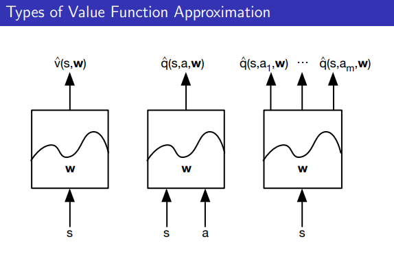
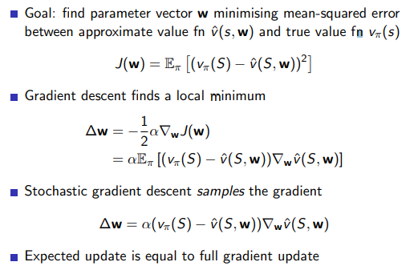
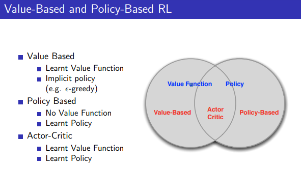
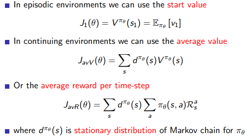
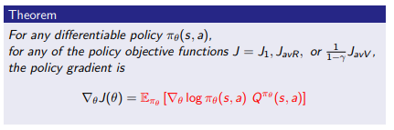
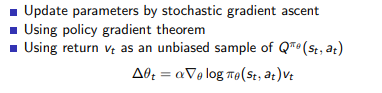

# Value Function Approximation

앞서 살펴본 lookup table 방식들은 상태가 매우 많은 문제에 대해서는 사용하기 어렵다. 상태가 많아질수록 모든 상태 혹은 행동에 대한 가치함수를 저장하기 힘들어지기 때문인데 이 때 근사 함수 (Function Approximation)를 사용해서 가치함수를 표현할 수 있다.

- **Linear combinations of features**
- **Neural network**
- Decision tree
- Nearest neighbour
- Fourier / wavelet bases
- etc...

위와 같이 다양한 근사 함수들 중 가중치의 미분이 가능한 선형 함수나 인공신경망을 사용한다.

오차 함수를 최소화 하는 근사 함수의 파라미터 w를 찾기 위해 경사 하강법을 사용한다.

# Policy Gradient

### Policy-Based Reinforcement Learning

지금까지는 사용한 강화학습 알고리즘은 상태 가치함수 혹은 행동-상태 가치함수를 바탕으로 학습하는 ‘가치 기반 강화학습’ 이다.

가치 기반 강화학습은 에이전트가 가치함수를 기반으로 행동을 선택하고 가치함수를 업데이트한다.

이와 다르게 ‘정책 기반 강화학습’이 존재하는데 정책 기반 강화학습은 가치함수를 토대로 행동을 선택하는 것이 아니라 정책을 학습하여 상태에 따라 해야할 행동의 확률 값을 반환하도록 한다.

### Advantages of Policy-Based RL

Advantages

- Better convergence properties
- Effective in high-dimensional or continuous action spaces
- Can learn stochastic policies

Disadvantages:

- Typically converge to a local rather than global optimum
- Evaluating a policy is typically inefficient and high variance

## Policy Objective Functions

Policy Gradient 에서는 누적 보상을 목적 함수로 사용한다. 목적 함수인 누적 보상이 최대가 되도록 정책신경망의 가중치를 업데이트한다.

목적 함수가 최대화할 수 있는 방향으로 모델을 업데이트 하기 위해서는 목적 함수를 미분해야 한다. 

목적 함수의 미분은 미분 가능한 정책 파이에 대해 Likelihood ratios를 활용한 Policy Gradient Theorem를 통해 계산한다.

## REINFORCE 알고리즘

정책 기반 강화학습은 가치함수를 가지고 있지 않기 때문에 위 식에서 q 값을 구할 수 없다. 따라서 q 대신 반환값 Gt를 사용하는 것을 REINFORCE 또는 몬테카를로 폴리시 그레디언트라고 부른다.

