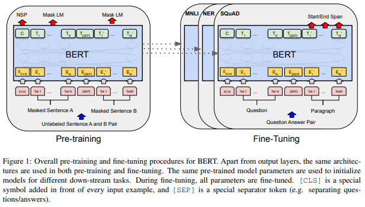
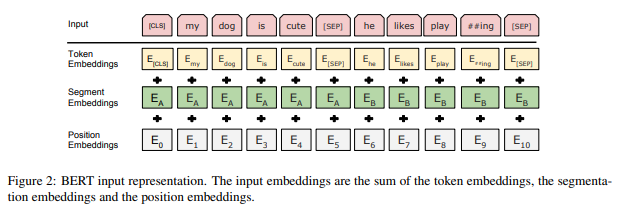

# BERT: Pre-training of Deep Bidirectional Transformers for Language Understanding

[논문 링크](https://arxiv.org/pdf/1810.04805.pdf)

## Abstract

버트는 새로운 자연어 표현 모델로 Bidirectional Encoder Representations from Transformers의 줄임말입니다.

버트는 라벨링하지 않은 텍스트 데이터들로부터 깊은 양방향 표현을 사전학습 하도록 설계되었습니다.

그 결과 사전학습된 버트 모델은 출력층을 하나 추가하여 파인 튜닝하는 것 만으로 QA, NLI 등의  다양한 태스크에서 SOTA를 달성하였습니다.

## Introduction

언어 모델의 사전 학습은 많은 자연어처리 태스크에서 효과적인 것으로 밝혀졌습니다. 이는 토큰 레벨의 태스크(개체명 인식, QA 등) 뿐만 아니라 문장 레벨의 태스크(NLI, 문장 요약)에서도 효과적입니다.

사전 학습된 언어 표현을 하위 태스크에 적용하는 방법은 두 가지가 있습니다. feature based 와 fine tuning 입니다.

ELMo와 같은 feature based 방법은 태스크를 위한 특정 구조가 사전 학습된 표현을 포함하고 있는 형태입니다.

GPT와 같은 fine tuning 방법은 하위 태스크를 위한 적은 파라미터들을 포함하여 전체 파라미터를 추가 학습 시킵니다.

두 가지 방법은 사전 학습 시에 단방향 언어 모델을 학습할 때와 같은 목적 함수를 사용합니다.

일반적인 언어 모델은 주로 단방향이고 이는 사전 학습 시 사용되는 모델의 구조를 제한합니다. 제한된 구조는 사전 학습 표현의 효율성을 낮추는데 특히 tine tuning 방법에서 그렇습니다.

예를 들어 GPT 같은 경우, 단방향 모델이기 때문에 모든 토큰이 해당 토큰의 이전의 토큰들의 정보만 어텐션 레이어에서 사용하게 됩니다.

이러한 제한은 문장 레벨의 태스크에서 최적의 결과를 내지 못하게 하며 모든 문맥의 정보를 포함해야 하는 토큰 레벨 태스크에서도 좋지 않습니다.

이 논문에서는 양방향 모델을 사용하여 앞서 얘기한 단방향 모델의 제한점을 극복했습니다.

BERT에서는 masked language model을 사전 학습의 목적으로 했는데 이 모델은 입력 문장에서 무작위로 토큰을 마스킹하고 문맥을 통해 원래 단어를 찾는 식으로 학습하는 것입니다.

단방향 언어 모델의 사전학습과 달리 MLM은 양방향 문맥을 융합한 표현을 학습할 수 있게 합니다.

MLM과 함께 다음 문장 예측 태스크를 사용했습니다.

## BERT

BERT는 pre-training과 fine-tuning 두 단계로 이루어집니다. 사전 학습 시에는 라벨링하지 않은 데이터를 통해 학습되며 파인 튜닝 때 사전 학습된 파라미터들을 통해 라벨링된 데이터로부터 하위 태스크를 학습합니다. 각 하위 태스크는 사전 학습된 같은 파라미터로 시작되지만 각각 다른 파인 튜닝 모델을 갖게 됩니다.

BERT의 차별화된 특징은 다른 태스크에서도 통합된 구조를 사용한다는 점입니다. 사전 학습 모델 구조와 최종 하위 태스크 모델 구조는 작은 차이밖에 없습니다.

BERT 모델의 구조는 트랜스포머의 양방항 멀티 레이어 입니다. 이는 트랜스포머와 동일한 구조를 사용하며 Base 모델과 Large 모델 두 가지를 학습시켰습니다.

BERT를 다양한 하위 태스크에서 사용할 수 있도록, BERT의 인풋은 하나의 토큰 시퀀스를 통해 하나의 문장과 문장 쌍을 모두 다룰 수 있게 했습니다. 토크나이저로는 30000개 단어의 워드피스 임베딩을 사용했습니다.

모든 문장의 시작에는 추가하는 CLS 토큰은 분류 작업에서 사용되며 모든 문장의 종합적인 표현을 나타냅니다.

하나의 시퀀스에 문장 쌍을 포함하는 경우 SEP 토큰을 통해 구분하거나 학습된 임베딩을 각 문장에 추가하여 구분했습니다.

버트의 입력은 다음 그림과 같이 구성됩니다.

## Pre-training BERT

버트의 사전 학습은 전통적인 단방향 언어 모델들을 사용하는 것이 아니라 두 가지 비지도 학습을 통해 이루어 집니다.

### Task #1: Masked LM (MLM)

깊은 양방향 표현을 학습하기 위해 입력 토큰들에 무작위로 마스크를 씌워 예측하는 방식으로 학습을 진행했습니다. mask 토큰의 마지막 히든 벡터를 소프트맥스 출력층에 통과시켜 예측합니다.

논문에서는 모든 시퀀스에서 15프로의 토큰을 마스킹했고 전체 입력을 재구축하기 보다는 마스킹된 단어만 예측했습니다.

파인 튜닝 모델에서는 mask토큰이 등장하지 않기 때문에 이 방법만 사용할 경우 사전 학습과 파인 튜닝 사이에 부조화가 발생합니다.

따라서 선택된 15프로의 토큰을 항상 마스킹 하는 것이 아니라 그 중 80프로만 마스킹하고 나머지 10프로는 랜덤한 토큰으로, 나머지 10프로는 변경하지 않는 방법을 사용했습니다.

### Task #2: Next Sentence Prediction (NSP)

QA나 NLI같은 하위 태스크들은 두 문장 사이의 관계를 이해하는 것에 기반을 두고 있습니다. 모델이 문장 관계에 대해 이해하도록 학습하기 위해 다음 문장 예측을 통해 사전 학습을 진행했습니다.

학습 데이터 문장에서 두 문장씩 뽑아 학습을 진행하는데 절반의 확률로 올바른 문장쌍이거나 랜덤한 문장쌍으로 구성합니다.

### Pre-training data

BooksCorpus (800M words) 와 English Wikipedia (2,500M words)

## Fine-tuning BERT

BERT를 통해 다양한 하위 태스크를 Fine tuning하는 것은 간단합니다. 모델에 적절한 입력과 출력을 입력하는 것으로 단일 문장과 문장 쌍의 태스크들을 모두 처리할 수 있습니다.

일반적으로 문장 쌍을 처리하는 모델의 경우 데이터를 모델에 입력하기 전에 각 문장을 인코딩 해줍니다. 반면 버트는 두 문장을 따로 처리하여 관계를 파악하는 것이 아니라 문장 쌍을 합친 입력을 인코딩하여 처리합니다.

각각의 태스크에서 입력과 출력에 대해 조절해서 입력해 주는 것 만으로 모델의 전체 파라미터를 태스크에 맞게 파인 튜닝할 수 있습니다.

버트의 출력 토큰들을 처리하여 태스크를 수행할 수 있게하는 출력층을 추가해 줍니다.

사전 학습과 비교했을 때 파인튜닝은 비교적으로 비용이 저렴합니다.