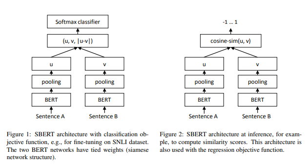

# SentenceBERT

# Sentence-BERT: Sentence Embeddings using Siamese BERT-Networks

[논문 링크](https://arxiv.org/pdf/1908.10084.pdf)

### Abstract

버트 계열의 모델들은 semantic textual similarity(STS)와 같은 sentence-pair regression tasks에서 최고의 성능을 나타냈다.

하지만 버트를 통해 문장 간의 유사도를 검색하려면 두 문장을 같이 입력해야 하고 때문에 특정 문장과 유사한 문장을 찾기 위해서는 갖고 있는 모든 문장들과 함께 버트를 통한 추론을 해야 한다.

이는 문장이 많아질수록 연산량이 크게 늘어나기 때문에 클러스터링과 같은 Task를 수행하기에 부적합하다.

### Introduction

센텐스 버트는 사전 학습된 버트를 통해 각 문장이 semantically meaningful 하도록 학습되었다.

semantically meaningful은 벡터 공간에서 의미가 비슷한 문장은 가까이 위치하는 것을 의미한다.

이는 BERT로는 할 수 없었던 유사도 비교, 클러스터링, 시맨틱 검색 등을 가능하게 한다.

버트는 문장 분류와 문장 쌍 회귀 문제에서 좋은 성능을 보인다.

하지만 버트는 문장을 쌍으로 입력 받아 추론하기 때문에 문장이 많아질수록 연산량이 커진다.

예를 들어 10000개의 문장이 있을 경우 문장 사이의 유사도를 모두 계산하기 위해서는 n·(n−1)/2 = 49,995,000 번의 추론이 필요하고 이는 V100 GPU를 사용하는 기준 65시간이 소요된다.

클러스터링과 시맨틱 검색을 위한 일반정인 방법은 각 문장을 벡터 공간에 맵핑하는 것이다.

버트를 통해 문장의 고정된 임베딩을 구하는 방법에는 출력 레이어의 평균을 구하거나 출력의 첫 번째 토큰인 CLS토큰을 사용하는 방법이 있다.

이렇게 구한 문장 임베딩은 Glove 임베딩을 통해 구한 문장 임베딩보다도 좋지 않은 결과를 나타낸다.

센텐스 버트는 샴 네트워크 구조를 통해 입력 문장의 임베딩을 구할 수 있는데 코사인 유사도나 유클리디안 거리 등과 같은 유사도 측정을 사용하여 문장 유사도를 계산할 수 있다.

10000개의 문장의 유사도를 구하려면 버트는 65시간이 소요되지만 센텐스 버트는 5초면 가능하다.

센텐스 버트는 다양한 문장 태스크들에서 최고 성능을 나타냈다.

### Related Work

먼저 버트는 트랜스포머 네트워크를 사전학습 시킨 모델로 다양한 NLP Task에서 최고 성능을 달성했다.

문장 쌍 회귀에서 버트는 두 개의 문장을 SEP 토큰으로 분리하여 입력 값으로 사용한다.

12 혹은 24개의 멀티 헤드 어텐션 레이어를 지나 회귀 함수를 통해 최종 출력을 구한다.

버트를 개선시킨 RoBERTa를 사용하면 조금 더 향상된 성능을 나타낸다.

버트의 문제점은 독립된 문장의 임베딩을 계산할 수 없기 때문에 버트를 통해 문장 임베딩을 구할 수 없다는 점이다.

문장 임베딩을 구하기 위해 NLI 데이터셋을 학습하는 것이 도움이 된다는 연구가 있었다.

### Model

버트를 통해 문장의 임베딩을 구하는 방법은 CLS토큰과 출력의 평균, 혹은 맥스풀링이 있다. 이 중에 센텐스버트는 출력 레이어의 평균을 사용하여 고정된 크기의 문장 임베딩을 구한다.

버트를 파인 튜닝하기 위해 샴 네트워크와 트리플렛 네트워크를 사용한다.

학습 데이터에 따라 세 가지 학습 방법이 있는데 두 문장의 임베딩 벡터와 벡터 간 차이를 합친 후 학습 가능한 가중치 행렬을 곱하여 소프트 맥스 값을 구하는 Classification Objective Function이 첫 번째 방법이다. cross entropy를 손실함수로 하여 최적화한다.

두 번째는 두 문장 임베딩의 코사인 유사도를 통해 학습하는 Regression Objective Function이다. 

세 번째는 기준 문장a와 긍정인 문장p, 부정인 문장n을 가지고 triplet loss를 구하는 Triplet Objective Function이 있다.

센텐스 버트를 학습하기 위해 SNLI와 Multi-Genre NLI 데이터셋을 사용하였다.

SNLI는 contradiction, eintailment, neutral로 라벨링된 570000개의 문장 쌍이고 MultiNLI는 430000의 문장 쌍이다.

배치 사이즈 16, LR 2e-5, warm-up ratio 0.1, epoch 1 로 하여 학습했다.

### Evaluation - Semantic Textual Similarity

센텐스버트의 성능을 평가하기 위해 Semantic Textual Similarity (STS)를 사용했다.

아래 표는 STS에 대해 학습하지 않은 추론 점수이다. 센텐스버트는 NLI데이터를 통해 학습했다.

버트는 Glove에 비해 성능이 떨어지는 반면 센텐스버트는 대부분의 Task에서 높은 성능을 나타냈다.

STS 데이터셋을 통해 학습한 점수이다.

학습 방법은 STS만 학습하거나 NLI+STS를 학습한 두 가지 버전이 있다.

### Ablation Study

센텐스버트를 학습할 때 풀링에 대한 전략과 임베딩 벡터의 결합에서 다양한 시도를 할 수 있다. 아래는 시도할 수 있는 전략들에 대한 점수이다.

### Computational Efficiency

센텐스버트는 매우 많은 문장들의 임베딩을 계산해야 하기 때문에 속도가 중요하다. 이를 확인하기 위해 다른 모델들과 속도를 비교 했는데 이 때 센텐스버트는 길이가 비슷한 문장끼리의 배치를 통해 패딩 사이즈를 조절하는 다이나믹 패딩을 사용하여 계산 시간을 줄였다.

### Conclusion

버트를 통한 문장 임베딩은 코사인 유사도와 같은 유사성을 계산하는데 부적합하다.

이를 극복하기 위해 버트를 샴 네트워크와 트리플렛 네트워크를 사용하여 파인튜닝한 센텐스버트를 고안했고 이는 다양한 문장 임베딩 Task에서 SOTA를 달성했다. 

센텐스버트는 각 개별 문장의 임베딩 계산을 통해 버트로는 65시간이 걸리는 클러스터링을 5초만에 수행할 수 있다.