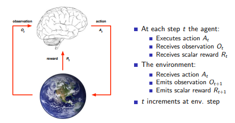
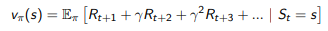

# 강화학습

강화란 좋은 행동을 점점 더 많이 하는 것

강화학습이란 에이전트가 환경과 직접 상호작용하며 환경이 주는 정보인 보상을 통해 어떤 행동을 해야 더 많은 보상을 얻을 수 있을지 학습하는 것

강화학습은 순차적으로 행동을 결정해야 하는 문제에서 사용할 수 있다.

강화학습을 하기 위해서 순차적 행동 결정 문제를 수학적으로 정의해야 한다.

이 때 사용하는 것이 Markov Decision Process

# MDP (Markov Decision Process)

MDP는 순차적 행동 결정 문제를 수학적으로 표현한 것으로 상태, 행동, 보상 함수, 상태 변환 확률, 할인율로 구성된다.

### 상태 (State)

S는 에이전트가 관찰 가능한 상태의 집합

### 행동 (Action)

에이전트가 상태 St에서 할 수 있는 행동의 집합 A

### 보상함수 (Reward)

에이전트가 학습할 수 있는 유일한 정보로서 에이전트가 어떤 상태에서 어떤 행동을 했을 때 환경이 에이전트에게 주는 정보

### 상태 변환 확률 (state transition probability)

어떤 상태 s에서 행동 a를 했을 때 다음 상태 s’에 도달할 확률

보상과 마찬가지로 환경의 일부이다.

### 할인율

현재에 가까운 보상을 더 가치 있는 것으로 판단하기 위해 미래의 보상일수록 가치를 낮춰주는 비율

에이전트는 두 가지 요소를 바탕으로 보상을 최대화한다.

### 정책

정책은 모든 상태에 대해 각각의 상태에서 어떤 행동을 할지 정의한 것

### 가치함수

어떤 상태 혹은 행동이 얼마나 좋은지 나타내는 함수

앞으로 받을 보상을 추정하여 현재 상태 혹은 행동의 가치를 추정한다.

- 상태 가치 함수 v(s) → 입력된 상태 s의 가치
- 상태-행동 가치 함수 (큐함수) q(s, a) →입력된 상태 s에서 행동 a의 가치