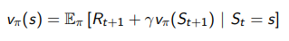
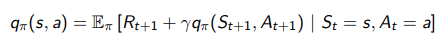
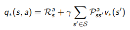
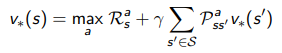
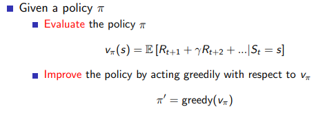
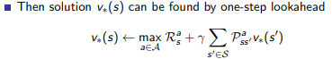

# 벨만 방정식

벨만 방정식은 현재 상태의 가치함수를 다음 상태의 가치함수를 통해 나타낸 식

위 식에 기대값의 개념이 들어가기 때문에 벨만 기대 방정식이라고 한다.

벨만 기대 방정식을 통해 가치함수를 계속 업데이트하면 현재의 정책을 따라갔을 때 얻을 실제 보상의 참 기댓값을 구할 수 있다.

벨만 기대 방정식을 풀면서 구한 가치함수를 통해 정책을 업데이트하다 보면 최적의 정책을 찾을 수 있다.

최적의 정책은 최적의 가치함수를 받게하는 정책이며 그때 가치함수 사이의 관계식을 벨만 최적 방정식이라고 한다.

# 다이나믹 프로그래밍

다이나믹 프로그래밍은 하나의 큰 문제를 여러 개의 작은 문제로 나누어 푸는 것

### Policy Iteration

벨만 기대 방정식을 사용해 정책을 평가(Evaluate)하고 이를 바탕으로 정책을 발전(Improve)시킨다.

### Value Iteration

Policy Iteration 과 같이 명시적인 정책을 발전시키는 것이 아니라 가치함수 안에 내재된 정책이 있다고 가정하고 가치함수만 업데이트 하여 최적의 정책을 찾는 것

다이나믹 프로그래밍의 한계

- 다이나믹 프로그래밍은 학습이 아닌 계산이다.
- 문제의 상태와 행동이 늘어날수록 계산량이 급격히 증가한다.
- 다이나믹 프로그래밍은 환경(보상, 상태 변환 확률)을 알고 있다는 가정이 필요하기 때문에 그 외의 문제에서는 사용할 수 없다.